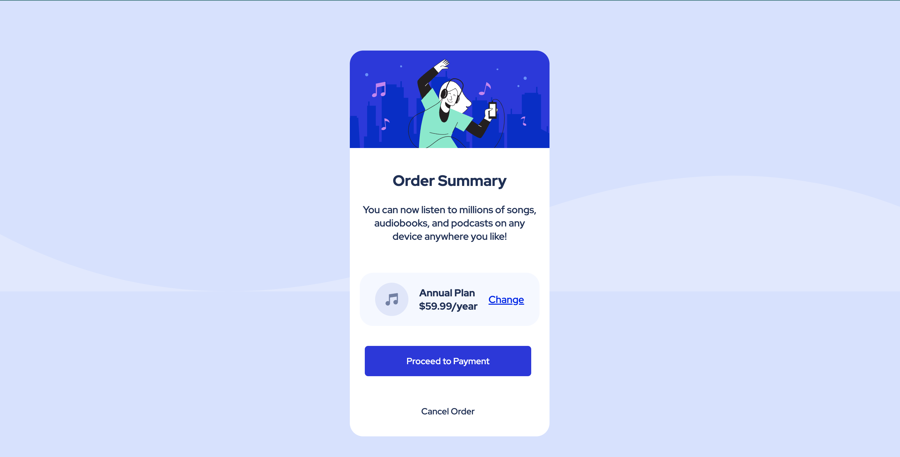
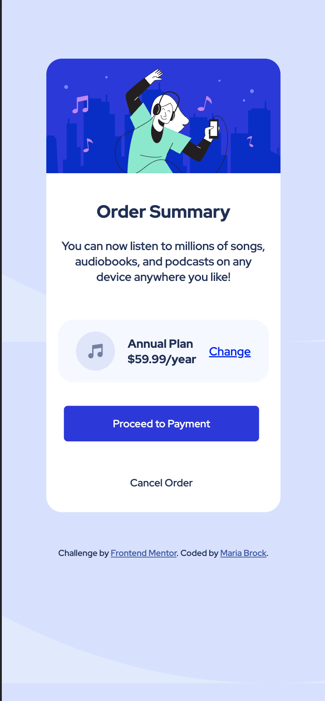

# Frontend Mentor - Order summary card solution

This is a solution to the [Order summary card challenge on Frontend Mentor](https://www.frontendmentor.io/challenges/order-summary-component-QlPmajDUj). Frontend Mentor challenges help you improve your coding skills by building realistic projects. 

## Table of contents

- [Frontend Mentor - Order summary card solution](#frontend-mentor---order-summary-card-solution)
  - [Table of contents](#table-of-contents)
  - [Overview](#overview)
    - [The challenge](#the-challenge)
    - [Screenshot](#screenshot)
    - [Links](#links)
  - [My process](#my-process)
    - [Built with](#built-with)
    - [What I learned](#what-i-learned)
    - [Continued development](#continued-development)
    - [Useful resources](#useful-resources)
  - [Author](#author)
  - [Acknowledgments](#acknowledgments)


## Overview

### The challenge

Users should be able to:

- See hover states for interactive elements

### Screenshot




### Links

- Solution URL: [Github](https://github.com/mariabrock/frontendmentorio-order-summary)
- Live Site URL: [Github Pages](https://mariabrock.github.io/frontendmentorio-order-summary/)

## My process

### Built with

- Semantic HTML5 markup
- CSS custom properties
- Flexbox
- CSS Grid
- Mobile-first workflow

### What I learned

Fun code:

```html
        <div class="plan">
          
          <div class="annual">
            <h4>Annual Plan</h4>
            <h4>$59.99/year</h4>
          </div>
          <p>
            <a
              href="https://www.frontendmentor.io?ref=challenge"
              target="_blank"
              >Change</a
            >
          </p>
        </div>
```
```css
button {
  border: none;
  margin: 1rem;
  padding: 14px 20px;
  text-align: center;
  text-decoration: none;
  display: inline-block;
  border-radius: 5px;
  width: 250px;
  transition-duration: 0.4s;
  cursor: pointer;
}


.payment {
  background-color: hsl(245, 75%, 52%);
  color: white;
}

.payment:hover {
  background-color: hsl(225, 100%, 94%);
  color: hsl(223, 47%, 23%);
  box-shadow: 0 12px 16px 0 rgba(0,0,0,0.24), 0 17px 50px 0 rgba(0,0,0,0.19);
  cursor: pointer;
}
```

### Continued development

- Undefined

### Useful resources

- [W3 Schools](https://www.w3schools.com/) - Super helpful HTML & CSS reference.

## Author

- Github - [@mariabrock](https://github.com/mariabrock)
- Frontend Mentor - [@mariabrock](https://www.frontendmentor.io/profile/mariabrock)
- LinkedIn - [@mariabrock](https://www.linkedin.com/in/maria-brock/)

## Acknowledgments
